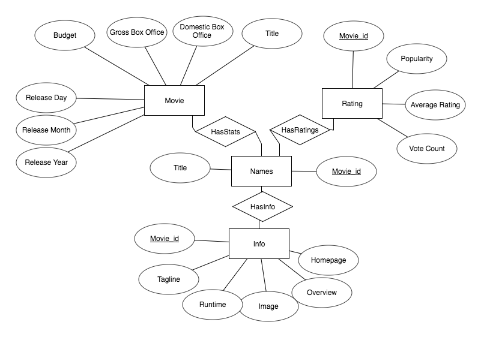
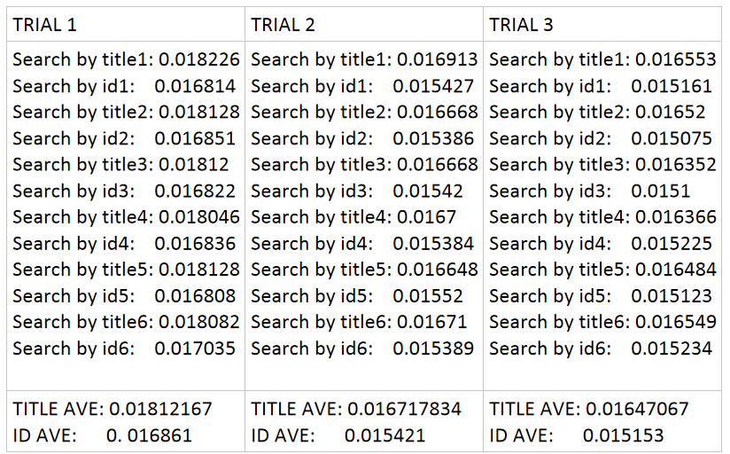
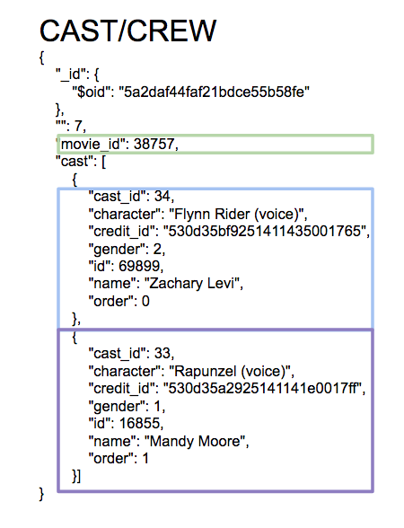

# cis450FinalProj
Group project with three other students.

Ryan Chen, Ryan Paul, Liz Reckart, Kevin Thomas
CIS 450
Presentation Date: 12/15/2017

FINAL REPORT

INTRO AND PROJECT GOALS
Our team created a site allowing users to look up general information on films as well as fun statistics related to the film industry.  We wanted to create a product that any movie-buff would want to use to find the answers to any questions they had while also keeping track of their favorite films.  Furthermore, we wanted to personalize the user’s experience as much as possible so we created sign-in functionality as well as a unique watchlist.

BASIC ARCHITECTURE   
Our data is hosted on two platforms - MySQL for the relational data and MLabs for the NoSQL component. 
We start by examining the structure of our MySQL component. We have a few entities: Release Date/Box Office Results, Ratings, and miscellaneous information. These tables related through the Names table which maps each movie to a unique ID. In addition, we also incorporated two additional tables - login and watchlist - to enable users to login with unique accounts and save their favorite movies. 

 

Moving on the the NoSQL components, we had a similar mindset. We have separate collections for cast, crew, genres, keywords, and production companies. We originally considered storing all the NoSQL information of each movie in one JSON object. However, as our user interfaces is designed to allow users to search movies through one of these “categories”, we decided to separate them to allow for faster, more efficient searches. In addition, some of the nested JSON objects were originally stored as strings and we initially processed data by parsing these long string sequences. In order to better optimize our database functionalities, we wrote scripts to convert these strings into nested JSON objects. 

FRONT END  
The front end was created based off traitional HTML/CSS/Javascript with a PHP server side (LAMP stack). Initially we hosted our site on an ubuntu server and made use of the cpanel platform. However, we weren’t able to install MongoDB so we made the switch to hosting on AWS using Elastic Beanstalk. We did most queries just by submitting forms (via. GET methods) as most of our queries were query-intensive and completely had a new set of data (no data was needed to be cached between clicks). The part of the page that was being reloaded each time we called the query was minute and therefore reloading it cost virtually nothing. In the case where we wanted to NOT have the page refresh, we use AJAX to substitute the same functionality. Examples of the GET method is most queries, such as looking up a movie title, which was as simple as formatting a link with the data embedded to do the search in the URL. The case we made for AJAX was adding to watchlist needed to add to function without refreshing the page as this would duplicate the large query to pull all movie data and the reload would be unpleasant user experience on the user as the page itself would be identical.

MAIN FEATURES  
We have four main features.  The first feature is a general movie search.  Here, the user can input a film title and our site will return the title, film poster, release date, director, tagline, runtime, genres, cast, producers, short description, budget, domestic box office, worldwide box office, the number of people who have favorited that film, and a link to the film’s official site.  The user can click on any genre, actor, producer, or director to pull up a list of other films linked to that particular person or genre.  
This leads us to our second feature.  A user can select an actor or genre that was output by the general search.  Once selected, we pull up a full list of all films the actor has been in or a full list of all films in the genre. 
The third feature is a guided search on general movie statistics and fun facts.  What we mean by this is the user has the ability to pick from different search questions, some requiring the user’s input.  Here the user can find things such as the highest worldwide grossing film per year or the average box office sales given a range of ratings.
The last feature is our watchlist.  If a user is signed in, they can add films to their personal watchlist.  Users can then pull up their full list of films they would like to watch.  Our site keeps a tracker for each film to show how many total people have added that particular film to their watchlist. Additionally, users can text their personal watchlist to any valid phone number to access it on the go.

TECHNICAL CHALLENGES  
Our biggest technical challenge by far was connecting to MongoDB.  This step was crucial to our project, as it would allow us to incorporate the NoSQL aspect into the project. We initially started on a simple shared hosting server that was running cPanel on top of it, as cPanel makes file editing a breeze for websites. However, we had to switch to AWS because we discovered the server we were originally using did not support MongoDB. On the shared hosting site we did not have terminal/root access to install the Mongo PHP Driver, making us therefore have to switch to an AWS EC2 instance to be able to accomplish this. So we created an AWS instance and installed the Elastic Beanstalk Command Line Interface (EB CLI).  Using the EB CLI we were able to ssh into our project and work from there. Then once we connected to our AWS instance using ssh, we installed the MongoDB driver using the pecl command. Then once we installed MongoDB and ssh’d into our instance we used vim to edit and update our code. Also having to use Vim and working in the terminal/shell wasn’t ideal, as it made it a bit more difficult to do things quickly, as opposed to working out of a text-editor.
	Another technical challenge we ran into was with cleaning the data in mlabs (the MongoDB data). We wanted to store certain objects as JSON arrays, but instead they were being stored as strings. After much tinkering, we were able to write a script that converted these strings to JSON arrays making it much easier to  run queries and likely optimizing run-time. 

Data
 We drew most of our data from two main data sources, StatCrunch and Kaggle:
●	https://www.kaggle.com/tmdb/tmdb-movie-metadata
●	https://www.statcrunch.com/app/index.php?dataid=2188684
The StatCrunch dataset contained the movie box office statistics that we incorporated while the Kaggle dataset provided most of the additional information we used. These datasets were extracted as CSV files, and data cleaning was done using a script written in R and another script written in mongo. Additionally, after joining these two datasets, we wrote a script to scrape movie poster images from Wikipedia as a third data source.   The data that was well suited to be stored in a relational format is hosted on MySQL, while NoSQL components are hosted on MLabs. 

PERFORMANCE EVALUATION 
We utilized indexing for three of our attributes.  We indexed the id attribute, genre attribute, and cast attribute.  In testing we found that searching by id rather than title gave us a 7.55% decrease in time (see Appendix A).  This is not only because of the indexing.  Id is an int and the title is a string - comparing strings takes more time than comparing ints.  We also found faster searches when using the indexed genre (Movies.genres.genres.id) and cast (Movies.cast.cast.id).  
	With regards to the JSON objects, certain attributes, such as the entire cast, were originally stored them as strings.  However, parsing the strings was taking too long so we wanted to try and improve this.  We converted the long strings to nested JSON objects which improved our search time and querying capabilities. An example can be found in Appendix B. 

POTENTIAL FUTURE EXTENSIONS  
One of the features we wanted to extend was the watchlist extension.  We wanted to expand its functionality so that it would be quite similar as to how the website GoodReads.  Currently a user can only add a film to their watchlist.  We want to break this single functionality into two functions -  “Want to Watch” and “Already Seen” options.  Once a user has seen a film, they can rate it on a five star scale.  They could also have the ability to write a review for it that anyone on the site could see.   If we added the ability for a user to add friends, then we would also add a “Recommend to a Friend” feature where you could send a recommendation to a friend.  Another fun feature we wanted to add would be a small two-player trivia ‘dual’.  Two friends could compete against each other on movie-related trivia questions.  We would also like to send the user our own recommendations based on which films they have added to their watchlist.
With regards to our queries, would want to implement a box office predictor.  With this feature, a user would input some basic information on a film that has not yet been released.   Our site would then output an estimate on how much the move would make, domestic and worldwide, based on all of the data from past films.
We would also like to extend our second main feature.  Rather than just selecting an actor or genre, we would create a search bar where you could choose to select to search by actor, director, producer, or genre and then type in the person’s name or specific genre.  
With regards to the watchlist feature, we would also like to extend it so that we could recommend similar movies to the user based on which films they have added to their watchlist.

Appendix A

------------------------

TOTAL TITLE AVE: 0.0171033913
TOTAL ID AVE:      0.01581167

7.55% decrease in time when you search by id rather than title

 
Appendix B
 

